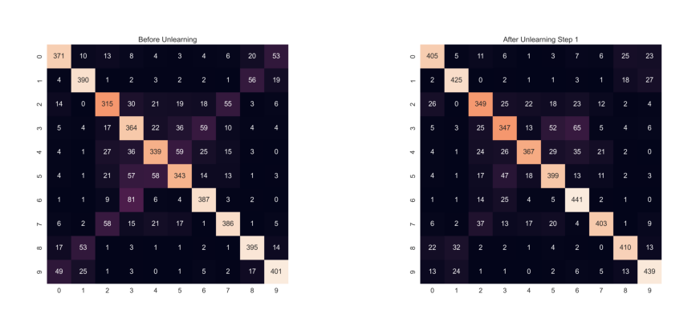

# What are we doing?
1. A code to poision the CIFAR10 dataset ~ mislabelling the images in the dataset.
2. Performing Unlearning in 2 orders ~ First and Second Order

# How to run?

1. Run [Cifar-10.ipynb](example_notebooks/Cifar_data.ipynb) file to download and prepare data.
2. Run [Backdoor-Unlearning](example_notebooks/Backdoor-Unlearning.ipynb)

# Results:

[First order Training results :](models/poisoning/budget-10000/seed-42/first-order/unlearning_results.json)

    "acc_clean": 0.8786,
    "acc_before_fix": 0.7382000088691711,
    "acc_after_fix": 0.7685999870300293,
    "acc_perc_restored": 0.21652407465275797,
    "diverged": false,
    "n_gradients": 512,
    "unlearning_duration_s": 3327.0377593769986,
    "num_params": 1798282

[Second order Training results :](models/poisoning/budget-10000/seed-42/second-order/unlearning_results.json)

    "acc_clean": 0.8786,
    "acc_before_fix": 0.7382000088691711,
    "acc_after_fix": 0.7829999923706055,
    "acc_perc_restored": 0.3190882217342048,
    "diverged": false,
    "n_gradients": 3420,
    "unlearning_duration_s": 8428.704430253,
    "num_params": 1798282

